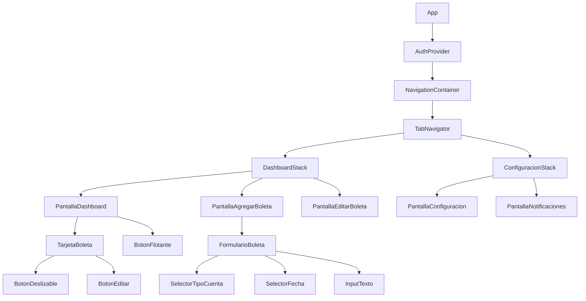
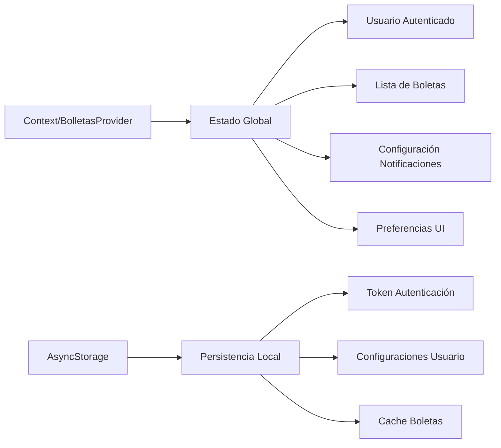
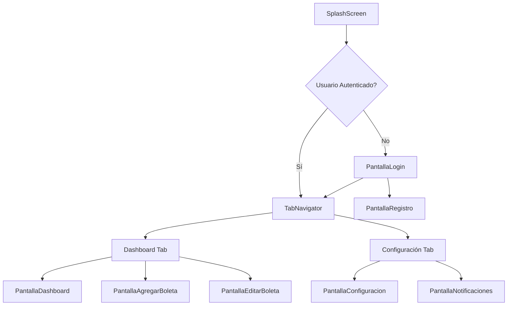
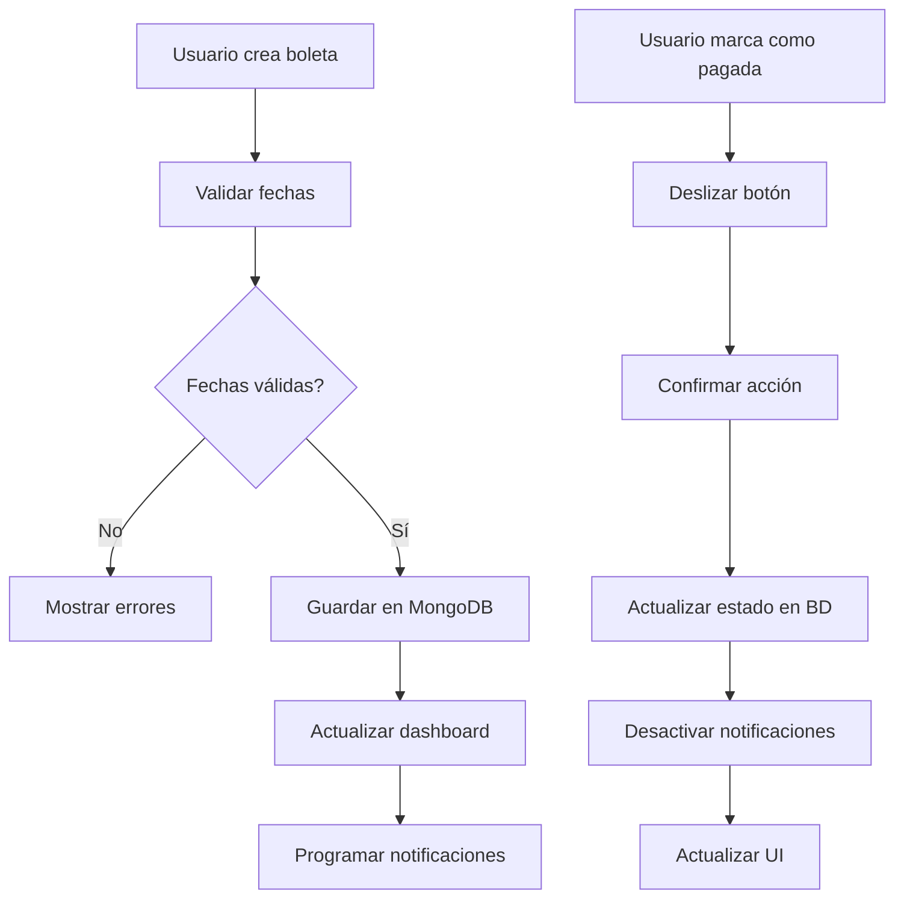
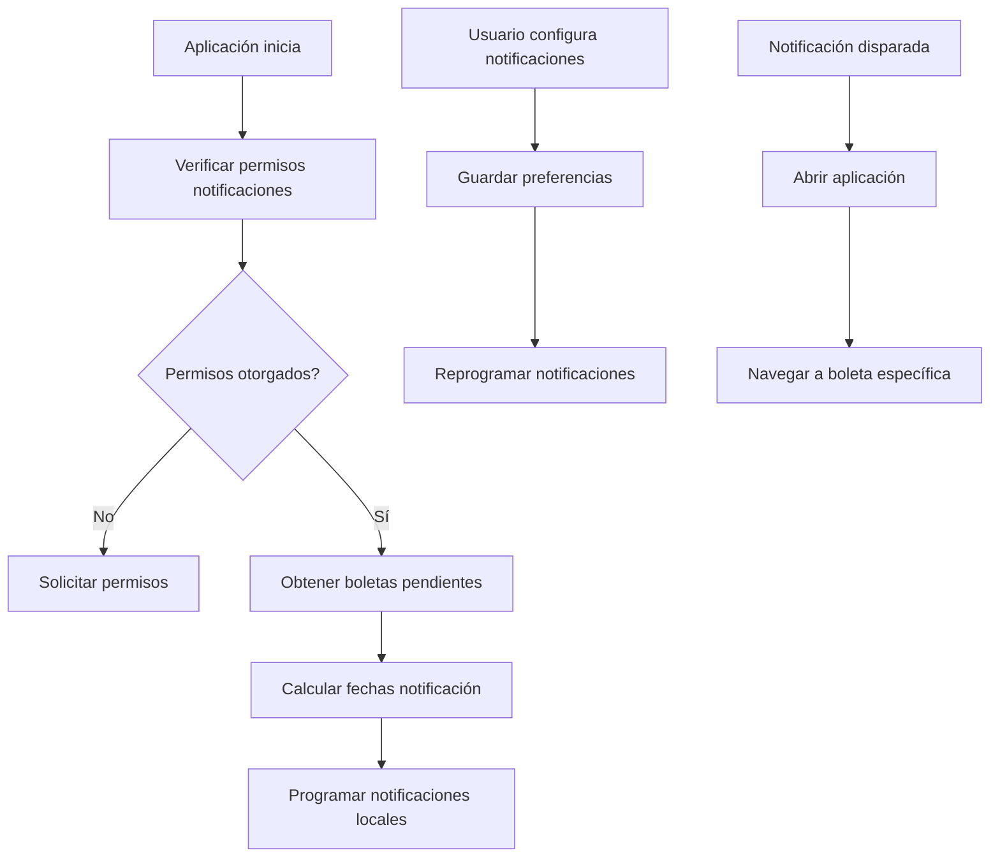
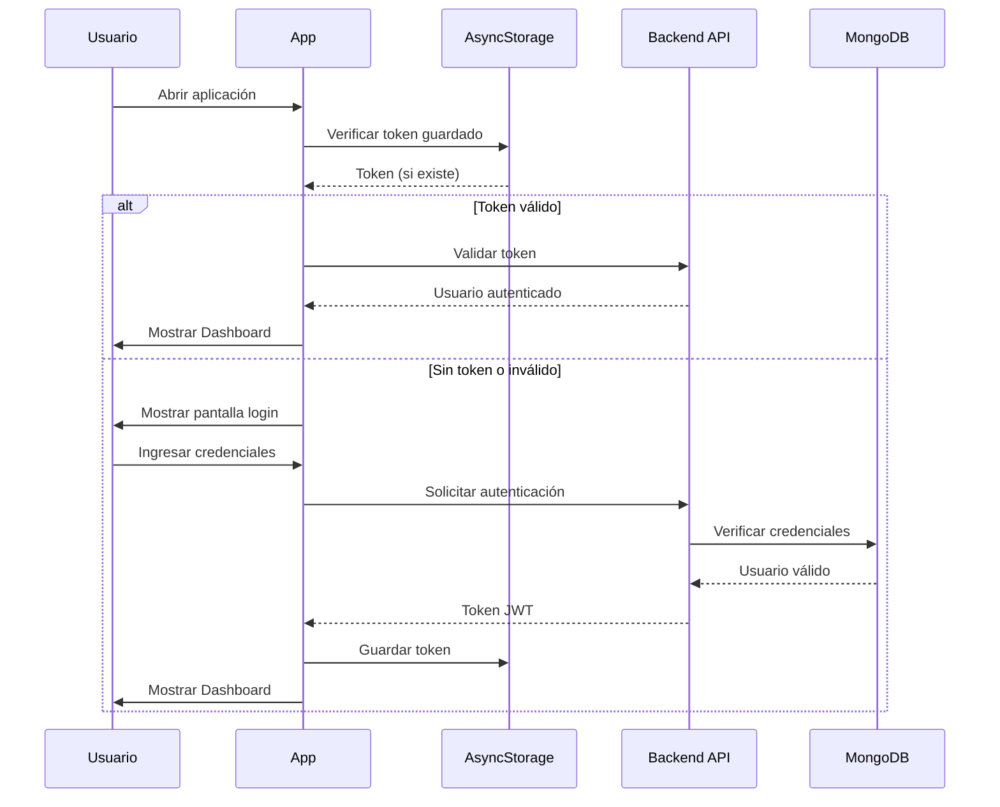

# BoletaIA - Aplicación de Gestión de Boletas de Servicios Básicos

## Visión General

BoletaIA es una aplicación móvil desarrollada en React Native con Expo que permite a los usuarios gestionar eficientemente sus boletas de servicios básicos (luz, agua, gas, internet, internet móvil y gastos comunes). La aplicación ofrece funcionalidades de registro, seguimiento, notificaciones y marcado de pagos para mantener organizadas las obligaciones de servicios básicos.

### Características Principales
- Dashboard intuitivo con vista de tarjetas de boletas
- Formulario de registro de nuevas boletas
- Sistema de notificaciones configurables
- Funcionalidad de marcar como pagado
- Edición de boletas existentes
- Interfaz vanguardista con esquema de colores negro/naranja

## Stack Tecnológico y Dependencias

### Frontend Framework
- **React Native**: 0.79.6
- **Expo**: ~53.0.22
- **Expo Router**: ~5.1.5 para navegación

### Librerías de UI y Navegación
- **@react-navigation/native**: ^7.1.6
- **@react-navigation/bottom-tabs**: ^7.3.10
- **@expo/vector-icons**: ^14.1.0
- **expo-haptics**: ^14.1.4 para feedback táctil

### Backend y Base de Datos
- **MongoDB**: Base de datos principal para almacenamiento de boletas y usuarios
- **API REST**: Para comunicación entre frontend y backend

### Librerías Adicionales Necesarias
- **react-native-gesture-handler**: Para interacciones de deslizamiento
- **expo-notifications**: Para notificaciones push
- **react-native-modal**: Para modales de edición
- **date-fns** o **moment.js**: Para manejo de fechas

## Arquitectura de Componentes

### Jerarquía de Componentes



### Definición de Componentes Principales

#### 1. PantallaDashboard
**Props:**
- `usuario`: Object - Información del usuario logueado
- `boletas`: Array - Lista de boletas del usuario

**Estado:**
- `boletasCargadas`: boolean
- `modalVisible`: boolean
- `boletaSeleccionada`: Object

**Funcionalidades:**
- Mostrar grid de tarjetas de boletas
- Filtrar boletas por estado (pendientes/pagadas)
- Navegación a formulario de nueva boleta

#### 2. TarjetaBoleta
**Props:**
- `boleta`: Object - Datos de la boleta
- `onMarcarPagado`: Function
- `onEditar`: Function

**Estado:**
- `deslizandoParaPagar`: boolean
- `confirmandoPago`: boolean

**Funcionalidades:**
- Mostrar información resumida de la boleta
- Botón deslizable para marcar como pagado
- Botón de edición

#### 3. FormularioBoleta
**Props:**
- `boletaInicial`: Object (opcional para edición)
- `onGuardar`: Function
- `onCancelar`: Function

**Estado:**
- `datosFormulario`: Object
- `erroresValidacion`: Object
- `guardando`: boolean

**Funcionalidades:**
- Validación de campos y fechas
- Envío de datos al backend

### Gestión de Estado



#### Estado de la Aplicación
```javascript
interface EstadoAplicacion {
  usuario: {
    id: string;
    nombre: string;
    email: string;
    tokenAutenticacion: string;
  };
  boletas: BoletaInterface[];
  configuracionNotificaciones: {
    tresDiasAntes: boolean;
    unaSemanaAntes: boolean;
    horaNotificacion: string;
  };
  ui: {
    tema: 'claro' | 'oscuro';
    cargando: boolean;
    error: string | null;
  };
}
```

## Enrutamiento y Navegación

### Estructura de Navegación



### Definición de Rutas

```typescript
// app/_layout.tsx
export default function RootLayout() {
  return (
    <BolletasProvider>
      <Stack>
        <Stack.Screen name="(auth)" options={{ headerShown: false }} />
        <Stack.Screen name="(tabs)" options={{ headerShown: false }} />
      </Stack>
    </BolletasProvider>
  );
}

// app/(tabs)/_layout.tsx
export default function TabLayout() {
  return (
    <Tabs screenOptions={{ 
      tabBarStyle: { backgroundColor: '#000000' },
      tabBarActiveTintColor: '#FF6B35'
    }}>
      <Tabs.Screen name="dashboard" options={{ title: 'Dashboard' }} />
      <Tabs.Screen name="configuracion" options={{ title: 'Configuración' }} />
    </Tabs>
  );
}
```

## Estrategia de Estilización

### Esquema de Colores

```javascript
export const Colores = {
  // Colores Principales
  negro: '#000000',
  naranja: '#FF6B35',
  
  // Colores Secundarios
  verde: '#10B981',
  rojo: '#EF4444',
  
  // Variaciones
  grisOscuro: '#1F1F1F',
  grisClaro: '#F5F5F5',
  blanco: '#FFFFFF',
  
  // Estados
  pendiente: '#FF6B35',
  pagado: '#10B981',
  vencido: '#EF4444',
  
  // Fondos
  fondoPrincipal: '#000000',
  fondoTarjeta: '#1F1F1F',
  fondoInput: '#2A2A2A'
};
```

### Sistema de Tipografía

```javascript
export const Tipografia = {
  titulo: {
    fontSize: 24,
    fontWeight: 'bold',
    color: Colores.blanco
  },
  subtitulo: {
    fontSize: 18,
    fontWeight: '600',
    color: Colores.blanco
  },
  cuerpo: {
    fontSize: 16,
    fontWeight: 'normal',
    color: Colores.grisClaro
  },
  pequeno: {
    fontSize: 14,
    fontWeight: 'normal',
    color: Colores.grisClaro
  }
};
```

### Componentes de Estilo Base

```javascript
// Tarjeta Base
export const TarjetaBase = StyleSheet.create({
  contenedor: {
    backgroundColor: Colores.fondoTarjeta,
    borderRadius: 12,
    padding: 16,
    marginVertical: 8,
    shadowColor: Colores.naranja,
    shadowOffset: { width: 0, height: 2 },
    shadowOpacity: 0.1,
    shadowRadius: 4,
    elevation: 3
  }
});

// Botón Primario
export const BotonPrimario = StyleSheet.create({
  contenedor: {
    backgroundColor: Colores.naranja,
    borderRadius: 8,
    paddingVertical: 12,
    paddingHorizontal: 24,
    alignItems: 'center'
  },
  texto: {
    color: Colores.blanco,
    fontSize: 16,
    fontWeight: '600'
  }
});
```

## Integración de API

### Endpoints del Servicio

```typescript
interface APIService {
  // Autenticación
  iniciarSesion(credenciales: CredencialesLogin): Promise<RespuestaAutenticacion>;
  registrarUsuario(datos: DatosRegistro): Promise<RespuestaAutenticacion>;
  cerrarSesion(): Promise<void>;
  
  // Boletas
  obtenerBoletas(usuarioId: string): Promise<BoletaInterface[]>;
  crearBoleta(boleta: NuevaBoleta): Promise<BoletaInterface>;
  actualizarBoleta(id: string, datos: ActualizacionBoleta): Promise<BoletaInterface>;
  marcarComoPagada(id: string): Promise<BoletaInterface>;
  eliminarBoleta(id: string): Promise<void>;
  
  // Notificaciones
  configurarNotificaciones(config: ConfiguracionNotificaciones): Promise<void>;
  obtenerNotificacionesPendientes(): Promise<NotificacionInterface[]>;
}
```

### Modelos de Datos

```typescript
interface BoletaInterface {
  id: string;
  usuarioId: string;
  tipoCuenta: TipoCuenta;
  nombreEmpresa: string;
  monto: number;
  fechaEmision: Date;
  fechaVencimiento: Date;
  fechaCorte: Date;
  fechaProximaLectura: Date;
  descripcion: string;
  estaPagada: boolean;
  fechaPago?: Date;
  fechaCreacion: Date;
  fechaActualizacion: Date;
}

enum TipoCuenta {
  LUZ = 'luz',
  AGUA = 'agua',
  GAS = 'gas',
  INTERNET = 'internet',
  INTERNET_MOVIL = 'internet_movil',
  GASTOS_COMUNES = 'gastos_comunes'
}

interface ConfiguracionNotificaciones {
  usuarioId: string;
  tresDiasAntes: boolean;
  unaSemanaAntes: boolean;
  horaNotificacion: string;
}
```

### Cliente HTTP

```typescript
class ClienteAPI {
  private baseURL = 'https://api.boletaia.app';
  private token: string | null = null;

  async realizarPeticion<T>(
    endpoint: string, 
    opciones: RequestInit
  ): Promise<T> {
    const headers = {
      'Content-Type': 'application/json',
      ...(this.token && { Authorization: `Bearer ${this.token}` }),
      ...opciones.headers
    };

    const respuesta = await fetch(`${this.baseURL}${endpoint}`, {
      ...opciones,
      headers
    });

    if (!respuesta.ok) {
      throw new Error(`Error API: ${respuesta.status}`);
    }

    return respuesta.json();
  }

  // Métodos específicos para cada endpoint...
}
```

## Lógica de Negocio (Arquitectura de Características)

### 1. Gestión de Boletas



#### Validaciones de Negocio

```typescript
class ValidadorBoleta {
  static validarFechas(boleta: NuevaBoleta): ErroresValidacion {
    const errores: ErroresValidacion = {};
    const hoy = new Date();
    
    // Fecha de emisión no puede ser futura
    if (boleta.fechaEmision > hoy) {
      errores.fechaEmision = 'La fecha de emisión no puede ser futura';
    }
    
    // Fecha de vencimiento debe ser posterior a emisión
    if (boleta.fechaVencimiento <= boleta.fechaEmision) {
      errores.fechaVencimiento = 'Debe ser posterior a la fecha de emisión';
    }
    
    // Fecha de corte debe ser anterior al vencimiento
    if (boleta.fechaCorte >= boleta.fechaVencimiento) {
      errores.fechaCorte = 'Debe ser anterior a la fecha de vencimiento';
    }
    
    return errores;
  }
  
  static validarMonto(monto: number): string | null {
    if (monto <= 0) {
      return 'El monto debe ser mayor a 0';
    }
    if (monto > 10000000) {
      return 'El monto es demasiado alto';
    }
    return null;
  }
}
```

### 2. Sistema de Notificaciones



#### Gestión de Notificaciones

```typescript
class GestorNotificaciones {
  async programarNotificacionesBoleta(boleta: BoletaInterface, config: ConfiguracionNotificaciones) {
    const notificaciones = [];
    
    if (config.tresDiasAntes) {
      const fechaTresDias = subDays(boleta.fechaVencimiento, 3);
      notificaciones.push({
        id: `${boleta.id}_3dias`,
        titulo: 'Boleta por vencer',
        mensaje: `Tu boleta de ${boleta.nombreEmpresa} vence en 3 días`,
        fecha: fechaTresDias,
        datos: { boletaId: boleta.id }
      });
    }
    
    if (config.unaSemanaAntes) {
      const fechaSemana = subDays(boleta.fechaVencimiento, 7);
      notificaciones.push({
        id: `${boleta.id}_semana`,
        titulo: 'Recordatorio de pago',
        mensaje: `Tu boleta de ${boleta.nombreEmpresa} vence en una semana`,
        fecha: fechaSemana,
        datos: { boletaId: boleta.id }
      });
    }
    
    await this.programarNotificaciones(notificaciones);
  }
  
  async cancelarNotificacionesBoleta(boletaId: string) {
    await Notifications.cancelScheduledNotificationAsync(`${boletaId}_3dias`);
    await Notifications.cancelScheduledNotificationAsync(`${boletaId}_semana`);
  }
}
```

### 3. Flujo de Autenticación



## Estrategia de Testing

### Testing de Componentes (Jest + React Native Testing Library)

```typescript
// __tests__/TarjetaBoleta.test.tsx
describe('TarjetaBoleta', () => {
  const boletaMock: BoletaInterface = {
    id: '1',
    tipoCuenta: TipoCuenta.LUZ,
    nombreEmpresa: 'CFE',
    monto: 1500,
    fechaVencimiento: new Date('2024-02-15'),
    estaPagada: false
    // ... otros campos
  };

  it('debe mostrar la información de la boleta correctamente', () => {
    render(<TarjetaBoleta boleta={boletaMock} />);
    
    expect(screen.getByText('CFE')).toBeOnTheScreen();
    expect(screen.getByText('$1,500')).toBeOnTheScreen();
    expect(screen.getByText('LUZ')).toBeOnTheScreen();
  });

  it('debe llamar onMarcarPagado cuando se desliza el botón', async () => {
    const mockMarcarPagado = jest.fn();
    render(
      <TarjetaBoleta 
        boleta={boletaMock} 
        onMarcarPagado={mockMarcarPagado} 
      />
    );
    
    const botonDeslizable = screen.getByTestId('boton-deslizable');
    fireEvent(botonDeslizable, 'onSwipeComplete');
    
    await waitFor(() => {
      expect(mockMarcarPagado).toHaveBeenCalledWith(boletaMock.id);
    });
  });
});
```

### Testing de Lógica de Negocio

```typescript
// __tests__/ValidadorBoleta.test.tsx
describe('ValidadorBoleta', () => {
  it('debe validar fechas correctamente', () => {
    const boletaInvalida = {
      fechaEmision: new Date('2024-02-15'),
      fechaVencimiento: new Date('2024-02-10'), // Anterior a emisión
      fechaCorte: new Date('2024-02-20') // Posterior a vencimiento
    };
    
    const errores = ValidadorBoleta.validarFechas(boletaInvalida);
    
    expect(errores.fechaVencimiento).toBeDefined();
    expect(errores.fechaCorte).toBeDefined();
  });
  
  it('debe validar montos correctamente', () => {
    expect(ValidadorBoleta.validarMonto(-100)).toBe('El monto debe ser mayor a 0');
    expect(ValidadorBoleta.validarMonto(0)).toBe('El monto debe ser mayor a 0');
    expect(ValidadorBoleta.validarMonto(1000)).toBeNull();
  });
});
```

### Testing de Integración API

```typescript
// __tests__/integration/APIService.test.tsx
describe('Integración API', () => {
  let clienteAPI: ClienteAPI;
  
  beforeEach(() => {
    clienteAPI = new ClienteAPI();
    // Configurar mocks para requests
  });
  
  it('debe crear una boleta exitosamente', async () => {
    const nuevaBoleta = {
      tipoCuenta: TipoCuenta.LUZ,
      nombreEmpresa: 'CFE',
      monto: 1500
      // ... otros campos
    };
    
    const boletaCreada = await clienteAPI.crearBoleta(nuevaBoleta);
    
    expect(boletaCreada.id).toBeDefined();
    expect(boletaCreada.nombreEmpresa).toBe('CFE');
  });
});
```